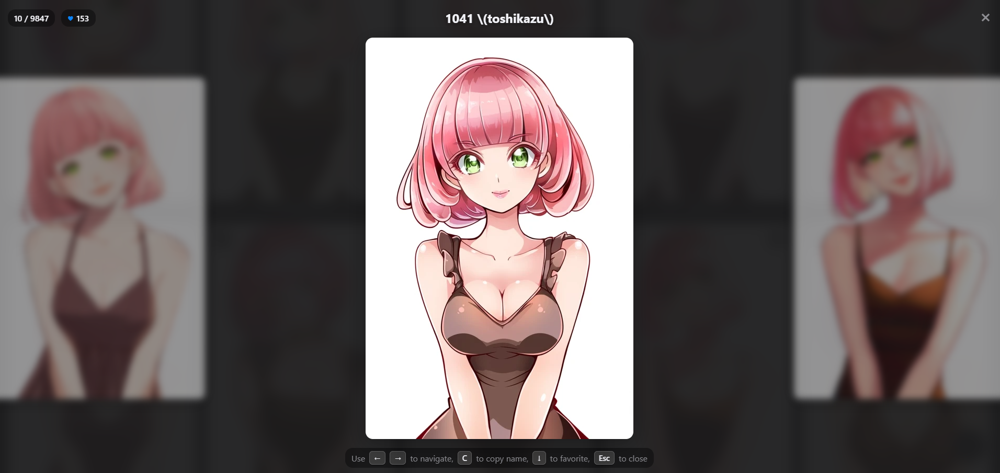

# Anima 2B Style Explorer 🎨

An interactive, high-performance visual database designed to explore artist styles within the **Anima 2B parameter model**. 

  

  

## 🚀 Overview
The **Anima 2B Style Explorer** is a specialized tool for AI artists and prompt engineers. It provides a standardized way to benchmark how the **Anima 2B model** (by CircleStone Labs) interprets specific artist influences from the **Danbooru** dataset.

Instead of guessing, you can now visually verify every style before you hit "Generate".

## ✨ Current Status: Goal Achieved!
- **Massive Library:** Now featuring over 20,000 danbooru-tagged artist previews.

## 🛠️ Key Features
*   **Visual Search & Filtering:**
 Instantly search over 20,000 styles by name. Jump directly to artists based on their dataset size (`Works`) or their **Uniqueness Rank**.
*   **Advanced Sorting:**
 Organize artists alphabetically (`A-Z`), by the number of training images (`Works`), or by their stylistic **Uniqueness** to find hidden gems.
*   **Favorites Management:**
 Save your favorite artists with a single click. Your collection is stored locally in your browser via IndexedDB.
*   **Import & Export:** 
Easily back up your favorites to a `.json` file or export a simple `.txt` list of artist names for your notes.
*   **Customizable Layout:**
 Adjust the gallery grid from 4 to 10 columns using a slider or keyboard hotkeys (`4`-`0`) for a personalized viewing experience.
*   **One-Click Copy:**
 Click on any artist card to instantly copy the name to your clipboard, ready to be pasted into your prompt.
*   **Focused Swipe Mode:**
    *   Enter a distraction-free, one-by-one viewing mode that automatically skips artists already in your favorites.
    *   **Start Anywhere:** Launch from the beginning, or middle-click any card to start from that point.
    *   **Continue Sessions:** Middle-click a card in your Favorites to jump back to the gallery and resume swiping where you left off.
    *   **Hotkeys:** Navigate with `←`/`→`, favorite with `↓`, and copy names with `C`.
*   **High Performance & Offline Use:**
 Built with lightweight Vanilla JS and optimized WebP images for blazing-fast speed. The entire app can be downloaded and run offline.

## 💾 Offline Usage
You can run this tool locally on your computer for offline access. The entire application is self-contained and is only ~800MB.

1.  **Download the project:**
    *   **Direct Download:** [Click here to download the ZIP file](https://github.com/ThetaCursed/Anima-Style-Explorer/archive/refs/heads/main.zip).
    *   **Or via Git:** `git clone https://github.com/ThetaCursed/Anima-Style-Explorer.git`

2.  **Unzip the folder** if you downloaded the ZIP file.

3.  **Run the application:** Simply open the `index.html` file in your web browser.

## 💻 Technical Stack
- **Core Model:** Anima 2B
- **Tagging System:** Danbooru-based
- **Frontend:** HTML5, CSS3 (Modern Flexbox/Grid), Vanilla JavaScript

## 🤝 Acknowledgments
- **CircleStone Labs** for the incredible Anima 2B model.
- The **Danbooru** community for the comprehensive tagging ecosystem.

## 📄 License
This project is an open-source visual guide for educational and artistic reference purposes.
